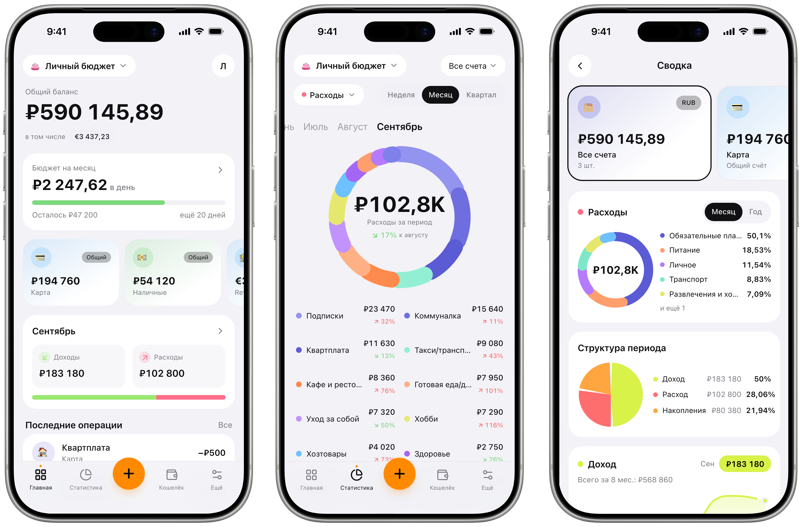
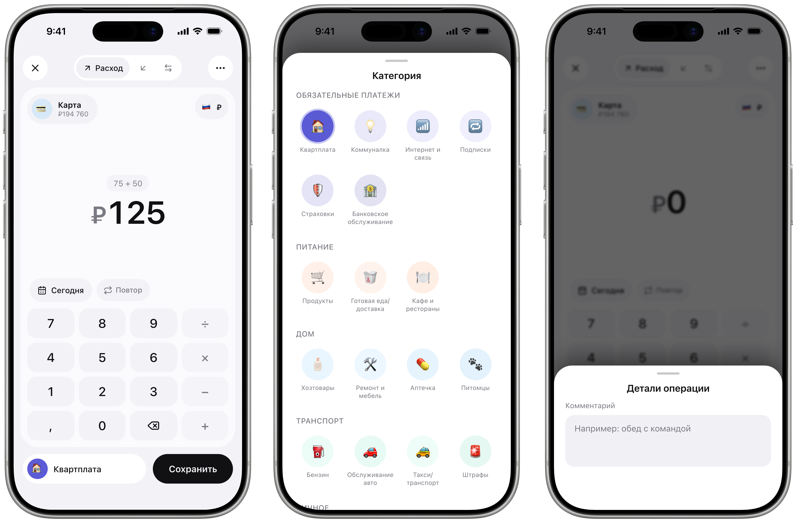
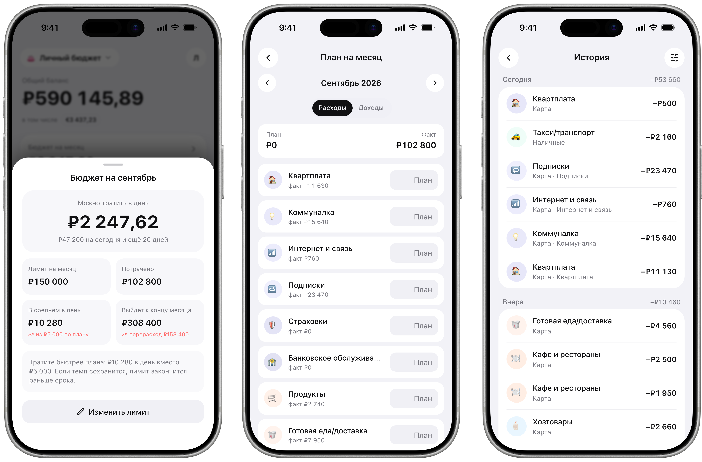

# Что умеет
 
Учёт личных и семейных финансов. Быстрый ввод, статистика, бюджет на месяц, счета в разных валютах.

1. Быстрый ввод калькулятор: сумма, категория, счёт за пару секунд
2. Бюджет на месяц покажет, сколько можно тратить в день, и пересчитает после каждой траты
3. Статистика куда уходят деньги, по категориям и месяцам
4. Счета в разных валютах, переводы, конвертация по курсу
5. Семейный бюджет общие счета и операции с близкими
6. Напоминания в удобное вам время
7. Выгрузка в Excel прямо в чат

# Как выглядит

